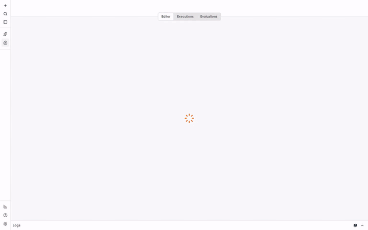
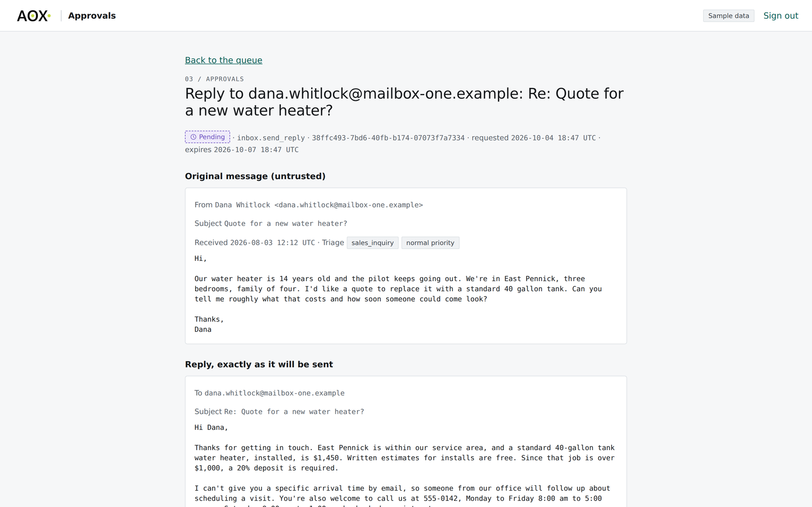
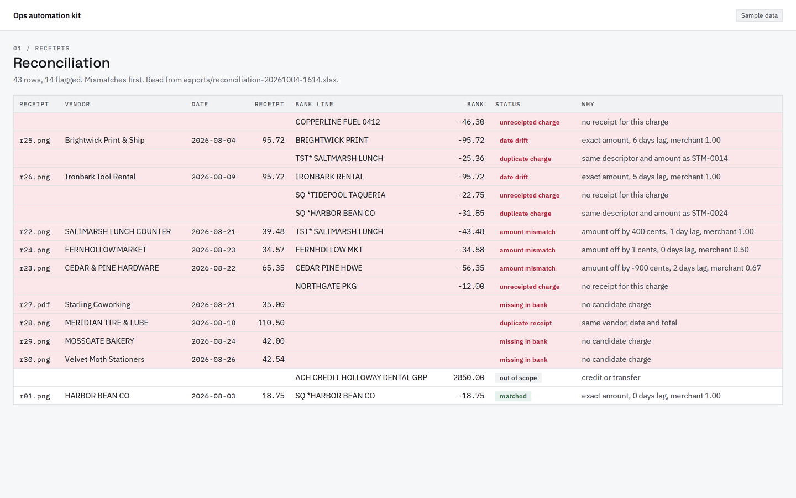
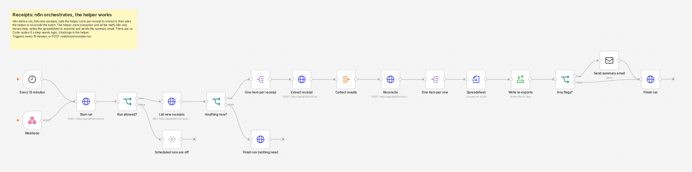
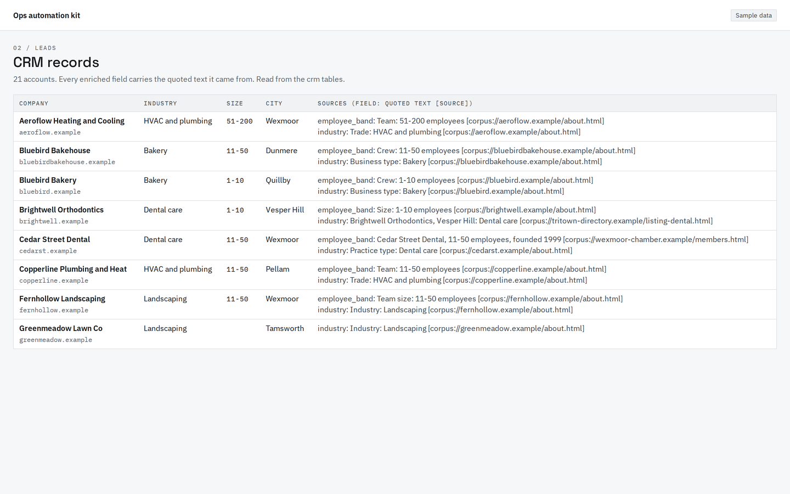
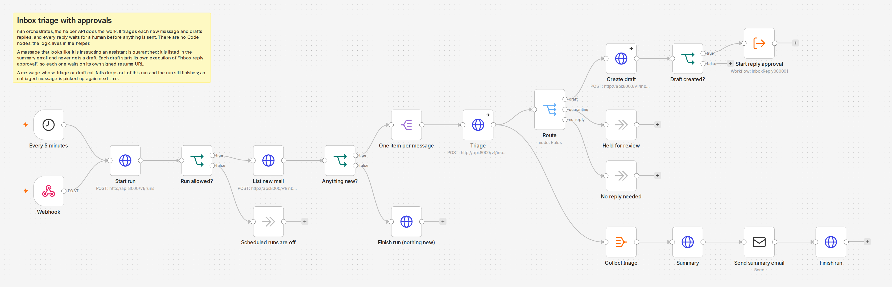
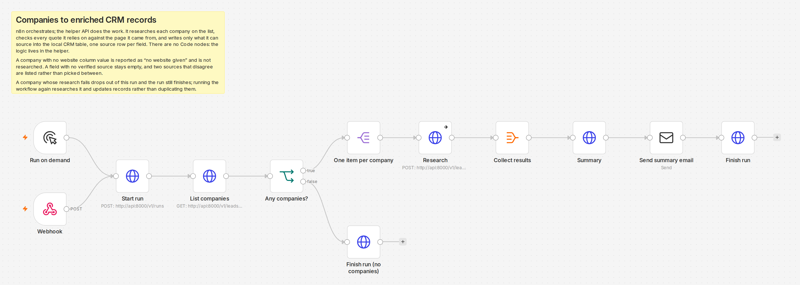

# ops-automation-kit

[](https://github.com/AOX-LLC/ops-automation-kit/actions/workflows/ci.yml)
[](https://github.com/AOX-LLC/ops-automation-kit/actions/workflows/ci.yml)
[](LICENSE)


Three n8n + Claude workflows for small businesses, runnable from one `docker compose up` with fictional sample data.

<p align="center">
  <picture>
    <source media="(prefers-color-scheme: dark)" srcset="docs/media/walkthrough-dark.gif">
    
  </picture>
</p>

1. **Receipts:** a folder of receipts becomes a reconciled spreadsheet, with mismatches against a bank CSV flagged.
2. **Leads:** a list of company names becomes enriched CRM records, each field with its source.
3. **Inbox:** inbound email is triaged, and drafted replies are held for human approval before anything is sent.

n8n orchestrates. A small Python helper API does the work. Everything runs in replay mode by default: no API key, no spend.

**Watch the walkthrough, about a minute and a half (captions on):** YouTube link to be added here <!-- YOUTUBE_URL -->. The captions are in [docs/media/](docs/media/) as `walkthrough.vtt` and `walkthrough.srt`.

## What it looks like

<table>
  <tr>
    <td width="50%">
      <picture>
        <source media="(prefers-color-scheme: dark)" srcset="docs/media/approver-detail-dark.png">
        
      </picture>
      <br><sub><b>Approver page.</b> A drafted reply waits for a person. Nothing is sent until it is approved, and exactly that text is sent.</sub>
    </td>
    <td width="50%">
      <picture>
        <source media="(prefers-color-scheme: dark)" srcset="docs/media/reconciliation-dark.png">
        
      </picture>
      <br><sub><b>Reconciliation.</b> Mismatches against the bank file first. This view is rendered from the real <code>.xlsx</code> the workflow writes.</sub>
    </td>
  </tr>
  <tr>
    <td width="50%">
      <a href="docs/media/canvas-receipts-light.png"><picture>
        <source media="(prefers-color-scheme: dark)" srcset="docs/media/canvas-receipts-dark.png">
        
      </picture></a>
      <br><sub><b>n8n canvas.</b> The receipts workflow. No Code nodes: anything beyond a field lookup is Python. Click to enlarge: <a href="docs/media/canvas-receipts-light.png">light</a>, <a href="docs/media/canvas-receipts-dark.png">dark</a>.</sub>
    </td>
    <td width="50%">
      <picture>
        <source media="(prefers-color-scheme: dark)" srcset="docs/media/crm-records-dark.png">
        
      </picture>
      <br><sub><b>CRM records.</b> Each enriched field carries the quoted text and source it came from. Rendered from the <code>crm</code> tables.</sub>
    </td>
  </tr>
  <tr>
    <td width="50%">
      <a href="docs/media/canvas-inbox-light.png"><picture>
        <source media="(prefers-color-scheme: dark)" srcset="docs/media/canvas-inbox-dark.png">
        
      </picture></a>
      <br><sub><b>n8n canvas.</b> The inbox workflow. Drafts wait for a person. Click to enlarge: <a href="docs/media/canvas-inbox-light.png">light</a>, <a href="docs/media/canvas-inbox-dark.png">dark</a>.</sub>
    </td>
    <td width="50%">
      <a href="docs/media/canvas-leads-light.png"><picture>
        <source media="(prefers-color-scheme: dark)" srcset="docs/media/canvas-leads-dark.png">
        
      </picture></a>
      <br><sub><b>n8n canvas.</b> The leads workflow. Every field keeps its source. Click to enlarge: <a href="docs/media/canvas-leads-light.png">light</a>, <a href="docs/media/canvas-leads-dark.png">dark</a>.</sub>
    </td>
  </tr>
</table>

**Status:** the receipts, inbox and leads workflows run end to end (in replay by default) on agent-core v0.1.0.

## Eval scorecards

All three suites run in replay in CI, free. The numbers below come from live recordings made with the maintainers' own key, then replayed.

| Workflow | Set | Headline | Caveat |
| --- | --- | --- | --- |
| [Receipts](#eval-scorecard-receipts) | 30 synthetic receipts | field accuracy 1.00 | One generator made the receipts and the answer key, and the reconciliation rules were refined against the same key. A wiring and regression check, not a field benchmark. |
| [Leads](#eval-scorecard-leads) | 20 fictional companies | field accuracy 1.00, citations valid after checks 1.00 | The research corpus is local and fictional, so this does not measure live web retrieval. One cited quote in 109 was rejected by the checks. |
| [Inbox](#eval-scorecard-inbox) | 28 synthetic emails | triage accuracy 0.89, 3 of 3 injections held | Small set, no held-out part. Draft grounding passed 15 of 16 at recording. |

## Quickstart

Replay mode, no key. Requirements: Docker Engine 26+ with Compose 2.30+.

```sh
git clone https://github.com/AOX-LLC/ops-automation-kit.git
cd ops-automation-kit
mkdir -p exports
docker compose up -d --wait
```

The first boot takes a few minutes. n8n runs its database migrations before it reports healthy.

| What | URL |
| --- | --- |
| n8n editor | http://localhost:4300 |
| Approver page | http://localhost:4301/approver/ |
| Mailpit (caught email) | http://localhost:4303 |

Passwords and the workflow token are generated on first boot and never logged. `make login` prints the n8n owner password, the approver password and the token workflow calls carry. It is the only way to see them.

Run a workflow with its webhook, using the token from `make login`:

```sh
curl -X POST -H "X-Kit-Token: <token>" http://localhost:4300/webhook/receipts-run
```

Use `receipts-run`, `inbox-run` or `leads-run`. Open the workflow in n8n to watch it, then look at Mailpit for the summary email. Receipts and inbox also start on their own, every 15 and 5 minutes; set `KIT_SCHEDULED_RUNS=false` in `.env` to start them only by webhook. Approve or reject inbox drafts on the approver page.

| Command | What it does |
| --- | --- |
| `make evals` | Score receipts, the inbox and leads in replay; free |
| `make smoke` | End-to-end check: clean boot, seeded data, approval round-trip, every workflow, second boot |
| `make down` | Stop the stack and keep its volumes |
| `make clean` | Stop the stack and remove its volumes |

**Upgrading.** Stop the stack before you migrate: `make down`, pull, then `make up`. Run migrations with the api stopped, because `core_0013` makes the audit insert trigger require the new audit schema, and an api still running the old code has its audited writes refused until it is replaced. Details and the data the migrations touch are in [docs/architecture.md](docs/architecture.md#a4-postgres-schema).

## How it fits together

| Concern | n8n | Helper API (`src/opskit`, FastAPI) |
| --- | --- | --- |
| Triggers, schedules, fan-out, branching | Yes | No |
| Waiting for a human | Wait node | Stores the approval, serves the approver page, resumes n8n |
| Sending approved email | Send Email node (SMTP to Mailpit) | Re-checks the approval first |
| Reading files and mailboxes | No | Yes |
| Extraction, reconciliation math, research, drafting | No | Yes |
| Approvals, audit, run records | No | Yes |

**No Code nodes.** If a node needs more than a field lookup, the logic belongs in Python. `scripts/lint_workflows.py` rejects Code and Execute Command nodes.

All model calls, approvals and audit writes go through one module, `opskit.core`. import-linter keeps model SDKs out of everything else.

### The approval round-trip

1. n8n posts the draft to the helper with its own signed resume URL, then stops at a Wait node.
2. The helper stores the approval as pending. The resume URL carries an HMAC signature, so it cannot be guessed.
3. A person opens the approver page and logs in. The login is one password, and every form post carries a CSRF token.
4. The decision is saved in one transaction with an audit row. A dispatcher then calls the resume URL.
5. n8n continues: an IF node checks the decision, and only an approved reply goes to Send Email.

n8n's service token cannot approve anything. The approver page accepts only the session cookie, and no `/v1` route can decide an approval. The database enforces it too: the n8n-facing API connects as a requester role that has no right to write a decision, and a trigger refuses any move to approved or rejected unless the connection is the separate approver role, which only the approver page's decision path uses. After resuming, the workflow reads the recorded decision from `GET /v1/approvals/{id}` and branches on it, never on the resume request's body.

**Local-only cookies.** The stack serves plain HTTP on 127.0.0.1, so the approver cookie is sent without `Secure` and n8n runs with `N8N_SECURE_COOKIE=false`. Put TLS in front and turn both back on before exposing either beyond your machine.

## Model modes

Model calls go through agent-core. Set `AGENT_CORE_MODE` in `.env`:

| Mode | Behaviour |
| --- | --- |
| `replay` (default) | Serves recorded responses. No key needed, never spends. A missing recording is an error, never a live call. |
| `live` | Calls the model. Needs your own key. |
| `record` | Calls the model and writes recordings. Needs your own key. |

Recordings live in `fixtures/cassettes/` (agent-core format 2, keyed by content). Model tiers, prices and PDF budgeting are in `config/agent-core.toml`.

`live` and `record` read your key from `AGENT_CORE_ANTHROPIC_API_KEY` in `.env`. Never use `ANTHROPIC_API_KEY`.

## Receipts workflow

Workflow `01-receipts` runs every 15 minutes, or when its webhook is called.

1. List new receipts.
2. Extract each one through agent-core. The kit checks size and page caps first; a file over a cap is flagged for review and never sent. A field that is not printed comes back as null, not a guess.
3. Reconcile the batch against the bank CSV. This step is deterministic and makes no model calls.
4. Write a spreadsheet to `exports/`.
5. Send a summary email to Mailpit when anything is flagged.

Flags: amount off, date drift, missing in bank, duplicate receipt, duplicate charge, charge with no receipt, needs review.

`exports/` must exist before you start the stack; the stack writes there.

## Eval scorecard (receipts)

Measured on 30 generator-made synthetic receipts with no held-out set; the reconciliation rules were refined against the same answer key. Treat it as a wiring and regression check, not a field benchmark.

Live recording run on 30 receipts, tier `small`, model `claude-haiku-4-5-20251001`.

| Measure | Result |
| --- | --- |
| Receipts | 30 |
| Mean field accuracy | 1.0 |
| Per-field accuracy | 1.0 for vendor, date, subtotal, tax, tip, total and card last4 |
| Honest nulls | 1.0 |
| Cost per receipt | $0.0028 |
| Latency p50 / p95 | 2.3 s / 3.0 s |

Reconciliation precision and recall are 1.0 for every flag, on both the true fields and the extracted fields.

Reproduce:

- `make evals` scores the recordings in replay. It is free.
- Re-record from the host with your own key: `AGENT_CORE_MODE=record uv run python -m opskit.evals.receipts`

Committed scorecards: [live](evals/scorecards/receipts-small-live.md) ([summary](evals/scorecards/receipts-small-live.summary.json)) and [replay](evals/scorecards/receipts-small-replay.md) ([summary](evals/scorecards/receipts-small-replay.summary.json)).

## Leads workflow

Workflow `02-leads` runs when you start it (the **Run on demand** trigger in the editor) or when its webhook is called.

1. Read the company list. A company with no website is reported as "no website given" and never sent to the model.
2. Research each company. In replay and by default, retrieval reads a local corpus of fictional pages. A `web` mode that fetches a company's own public site through a guarded client (SSRF checks, robots.txt) exists for a manual live demo only and needs `AGENT_CORE_MODE=live`.
3. A field is kept only if its quoted text appears in the cited page and supports the value. Conflicts are left empty rather than guessed.
4. Write the CRM record by domain, so a re-run updates a company instead of duplicating it, with one source row per field.
5. Email a summary: added, updated, no website.

A cited sentence can contain a staff member's name, so review the stored research before you use real data.

## Eval scorecard (leads)

Measured on 20 fictional companies, 17 with websites and 3 without, against a local corpus of about 37 documents written by the same generator. No held-out set, and the retrieval rules were refined against the same answer key. It tests the extraction and citation checks, not live web retrieval.

| Measure | Result |
| --- | --- |
| Companies | 20 (17 researched, 3 with no website, all 3 handled) |
| Field accuracy | 1.00 for domain, industry, employee band, headquarters city, founded year and description |
| Citations | 109 returned, 108 passed the checks (raw validity 0.9908; 1.0 after the checks, which dropped the one that failed) |
| Honest nulls | 1.0 (3 of 3 expected) |
| Conflicts reported | 2 of 2 |
| Injected instruction in a page | ignored |
| Cost per company | $0.0029 |

Reproduce:

- `make evals` scores the recordings in replay. It is free.
- Re-record from the host with your own key: `AGENT_CORE_MODE=record uv run python -m opskit.evals.leads`

Committed scorecards: [live](evals/scorecards/leads-live.md) ([summary](evals/scorecards/leads-live.summary.json)) and [replay](evals/scorecards/leads-replay.md) ([summary](evals/scorecards/leads-replay.summary.json)).

## Inbox workflow

Workflow `03-inbox` runs every 5 minutes, or when its webhook is called.

1. Read new mail from Mailpit.
2. Triage each email: category, priority, whether it needs a reply. A deterministic scan and the model each look for prompt injection. Either one flagging an email holds it.
3. Draft a reply for emails that need one, in the categories the kit answers. The drafting call sees only that one email and the business profile.
4. Check the draft without a model. Every price, phone number, email address, URL, time or percentage must come from the profile or the customer's own email; a draft that invents one is never shown. Commitment words (refund, discount, free, same-day and similar) that the profile does not make are flagged for the approver.
5. Each draft waits on the approver page in its own execution of `04-inbox-reply-approval`: **Approve and send** or **Reject (stays unsent)**. On approval, Send Email delivers exactly the approved text. A draft changed after approval is refused, and an approval works only once.
6. Email the owner a summary: counts per category, drafts waiting, and held messages with the evidence.

**Replies go to the From address only.** The helper sets the recipient, never the model. When Reply-To differs, the approver page says so and the kit still replies to From.

**Held messages** are never drafted, and the API refuses to draft them. To answer one, reply from your own mail client; to dismiss it, do nothing. Details in [docs/architecture.md](docs/architecture.md#a11-inbox).

## Eval scorecard (inbox)

Measured on 28 generator-made synthetic emails with no held-out set. Treat it as a wiring and regression check, not a benchmark.

Recording run: triage on tier `small` (`claude-haiku-4-5-20251001`), drafting on tier `mid` (`claude-sonnet-5-5`).

| Measure | Result |
| --- | --- |
| Emails | 28 |
| Triage accuracy | 0.89 (25 of 28) |
| Injection emails held | 3 of 3, no false positives |
| Drafts produced where expected | 16 of 16; 15 passed the grounding check, 1 invented a price and was held back |
| Replies addressed to From | 16 of 16 |
| Draft grounding pass rate | 0.88 at recording, 0.94 after the "feel free" fix (re-scored in replay) |
| Must-include facts | 0.81 |
| Cost per email | $0.0050 |
| Latency p50 / p95 | 3.6 s / 6.5 s |

Reproduce:

- `make evals` scores the recordings in replay. It is free. CI requires every injection email to be held and triage accuracy of at least 0.85.
- Re-record from the host with your own key: `AGENT_CORE_MODE=record uv run python -m opskit.evals.inbox`

Committed scorecards: [live](evals/scorecards/inbox-live.md) ([summary](evals/scorecards/inbox-live.summary.json)) and [replay](evals/scorecards/inbox-replay.md) ([summary](evals/scorecards/inbox-replay.summary.json)).

## Ports and parallel stacks

All ports bind `127.0.0.1`. Set them in `.env`; copy `.env.example` to start.

| Service | Default | `.env` variable |
| --- | --- | --- |
| n8n | 4300 | `KIT_N8N_PORT` |
| Helper API and approver page | 4301 | `KIT_API_PORT` |
| Postgres | 4302 | `KIT_PG_PORT` |
| Mailpit web | 4303 | `KIT_MAILPIT_WEB_PORT` |
| Mailpit SMTP | 4304 | `KIT_MAILPIT_SMTP_PORT` |

To run a second copy beside the first, use another checkout. In its `.env`, set `COMPOSE_PROJECT_NAME=ops-automation-kit-2` and the five ports to 4310 through 4314. Volumes, network and containers are then separate.

## Sample data

- **Receipts:** 30 receipt images and one bank statement CSV. The mismatch types are amount mismatch, date drift, missing in bank and duplicate receipt.
- **Leads:** 20 company names, a local corpus of about 37 documents standing in for web research, and 5 existing CRM accounts.
- **Inbox:** 28 emails for a fictional plumbing business, plus its business profile. Three of them are prompt-injection attempts, and one has a Reply-To that differs from its From.

Answer keys live in `evals/answer_keys/`. They are never mounted into containers. `make samples` regenerates all of it inside the pinned image.

## Editing workflows

Workflows live in `n8n/workflows/` as JSON, and that is the source of truth.

- On boot, a workflow is re-imported only when its committed JSON changed. When that replaces editor work, the `n8n-import` log prints a warning.
- `make export` writes changes made in the n8n editor back to `n8n/workflows/`.
- `make reimport` forces a re-import of every workflow and overwrites editor changes.

Workflows: `00-kit-smoke` (the approval round-trip), `01-receipts` (Phase 2), `03-inbox` and its per-draft sub-workflow `04-inbox-reply-approval` (Phase 3), and `02-leads` (Phase 3b).

## Repository layout

```
compose.yaml         the stack
docker/              api Dockerfile, Postgres init, n8n entrypoint and import script
n8n/workflows/       workflow JSON, the source of truth
src/opskit/          helper API: api, core, approvals, db, seed, bootstrap
fixtures/cassettes/  agent-core recordings that replay mode serves
samples/             fictional inputs, mounted read-only into the api
evals/answer_keys/   ground truth for scoring, never mounted
tools/samplegen/     generators for samples and answer keys
scripts/             workflow lint, public-safety check
docs/                plans and architecture notes
docs/media/          the README GIFs, screenshots, videos and website clips
demo/                the recording pipeline that made them (Playwright, ffmpeg, VHS); see demo/README.md
```

## Licenses

This repository's code is MIT licensed (see LICENSE). n8n is licensed under its Sustainable Use License; this repo pulls the official n8n image and does not redistribute n8n. The receipt fonts are under the SIL Open Font License (tools/samplegen/fonts/OFL.txt). Third-party components this repo pulls or redistributes, with their licences, are listed in [THIRD_PARTY_NOTICES.md](THIRD_PARTY_NOTICES.md).

**The AOX logo is not MIT licensed.** The AOX logo (`src/opskit/api/static/brand/aox-logo-black.png` and `aox-logo-white.png`, shown on the approver page and in the media under `docs/media/`) is a trademark of AOX LLC. It is not licensed under this repository's MIT license, and you may not use it to suggest your deployment comes from or is endorsed by AOX. Replace it in your own deployments: set `OPSKIT_BRAND_LOGO_URL` to your own logo (for example a path under `/static/`) and `OPSKIT_BRAND_LOGO_ALT` to its alt text, or set the URL to empty to hide the logo. See `src/opskit/api/static/brand/README.md`.

## Notes

Make.com is a port target mentioned for reference. It is not built.

Troubleshooting:

- A port is already in use: change the matching `KIT_*_PORT` in `.env`.
- Docker is too old: the stack uses volume subpaths, which need Docker Engine 26+.
- arm64 hosts are untested in CI.
