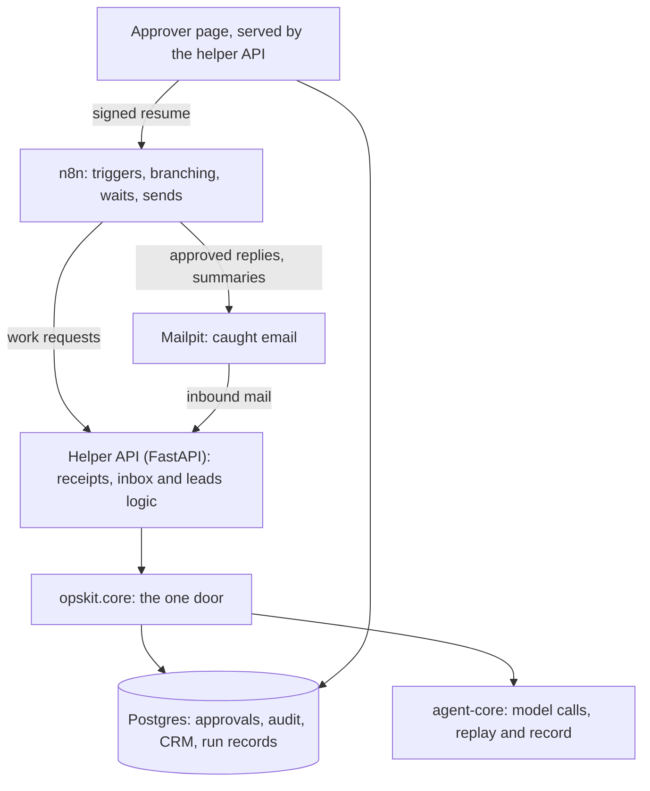

# Case study: three small-business workflows where the model can't act alone

Receipts, inbound email and sales leads are the same job: someone reads a pile of messy input, decides what it says, and acts on it. A model can do the reading well. It can also invent a price, trust a line buried in a web page, or send an email nobody checked. This kit shows three workflows built so that the model reads and a person or plain code decides.

Everything runs from one `docker compose up`, in replay mode, on fictional data. No API key, no spend.

## The problem

- **Receipts.** A folder of receipts has to be matched against the bank statement. Someone retypes totals and hunts for the ones that don't line up.
- **Inbox.** Customer email needs sorting, and most replies are the same few answers. A drafted reply that quotes the wrong price is worse than no draft.
- **Leads.** A list of company names needs industry, size and location filled in. Each value is only worth having if you can see where it came from.

## The architecture

n8n owns triggers, schedules, branching, waiting for approvals and sending approved email. A small FastAPI helper does the work: reading files and mailboxes, extraction, reconciliation, research, drafting, approvals and audit. There are no Code nodes; if a step needs more than a field lookup, it is Python. Model calls, approvals and audit writes all go through one module, `opskit.core`, built on agent-core. An import linter keeps model SDKs out of everything else.

## The evals

Each workflow has a scored suite. CI replays the recordings for free; the numbers below come from the live recording run.

| Workflow | Set | Result |
| --- | --- | --- |
| Receipts | 30 synthetic receipts | Field accuracy 1.00. Reconciliation precision and recall 1.00 for every flag. |
| Leads | 20 fictional companies (17 with a website, 3 without) | Field accuracy 1.00. 109 citations returned, 108 passed the checks. |
| Inbox | 28 synthetic emails | Triage 25 of 28 (0.89). 3 of 3 injection emails held, no false positives. 16 of 16 drafts produced. |

**These are regression checks, not benchmarks.** The data is synthetic. For receipts and the inbox, one generator wrote both the inputs and the answer key, and the rules were refined against that same key. The leads corpus is local and fictional, so it does not measure live web retrieval. None of the sets has a held-out part. The inbox is the weakest result: 3 emails were mis-triaged, and the drafts included the facts the answer key required 0.81 of the time. Real documents will behave differently, which is why a person stays in the loop.

## Cost and latency per item

From the recording run, at the model tiers set in `config/agent-core.toml`. Prices are the config's, not a quote.

| Workflow | Tier | Cost per item | Latency p50 / p95 |
| --- | --- | --- | --- |
| Receipts | small (`claude-haiku-4-5-20251001`) | $0.0028 per receipt | 2.3 s / 3.0 s |
| Leads | small | $0.0029 per researched company | 3.4 s / 4.3 s |
| Inbox | small for triage, mid (`claude-sonnet-5-5`) for drafts | $0.0050 per email | 3.6 s / 6.5 s |

Whole-run totals: $0.083 for the 30 receipts, $0.049 for the 20 companies and $0.139 for the 28 emails. The inbox figure averages over all emails, including the 12 that never get a draft.

## What the safeguards caught

- **A hallucinated price.** In the recording, one draft quoted a $290 price that was in neither the business profile nor the customer's email. A check in code, with no model involved, requires every price, phone number, address, URL, time and percentage in a draft to appear in a source. The draft was marked failed and never reached the approver. The same check flagged a harmless "feel free" as a commitment; that was a bug in the check, fixed and re-scored (grounding 0.88 at recording, 0.94 after).
- **Citations checked by code.** A lead field is kept only if its quote appears in the cited page and supports the value. Of 109 citations the model returned, 108 passed; the one that failed was dropped and the field left empty. An earlier version asked the model for the company's domain, and a manual run refused its answer as a mismatch, so the domain is now derived by code from the website given.
- **Injections quarantined.** Two independent checks look for prompt injection: a deterministic scan and the model's own flag, whose evidence quote must really occur in the email. Either one holds the message. All 3 injection emails were held, none was drafted, and the owner's summary shows the evidence. An instruction planted in a lead's web page was ignored.
- **Approvals the agent can't grant.** The n8n-facing API connects to Postgres as a role with no right to write a decision, and a trigger refuses any move to approved or rejected unless the connection is the separate approver role. Direct SQL with the agent's credentials cannot approve a reply. An approval is bound to a hash of the exact text, works once, and a draft edited after approval is refused.

## Trade-offs and what is out of scope

- A person reads everything that leaves the building. Drafts can't be edited on the approver page; a reply that needs changes is rejected and written by hand.
- Held messages are never answered by the kit, even if the hold is a false alarm.
- Leads reads only a company's own public site, through a guarded fetcher that respects robots.txt. There is no search, no JavaScript rendering and no PDF reading.
- The database split stops SQL-level mistakes and a leaked requester credential. It does not stop compromise of the whole API process, and it cannot tell which human approved.
- The stack is local-only: plain HTTP on 127.0.0.1. Put TLS in front before exposing it. Replies don't thread in the customer's mail client.
- Not built: a Make.com port, hosting, and any arm64 or Windows testing.

## Links

- Repository: [github.com/AOX-LLC/ops-automation-kit](https://github.com/AOX-LLC/ops-automation-kit)
- Walkthrough video, about a minute and a half, captions on: YouTube link to be added here <!-- YOUTUBE_URL -->
- Detail: [README](../README.md), [architecture notes](architecture.md) and the committed [scorecards](../evals/scorecards/)
